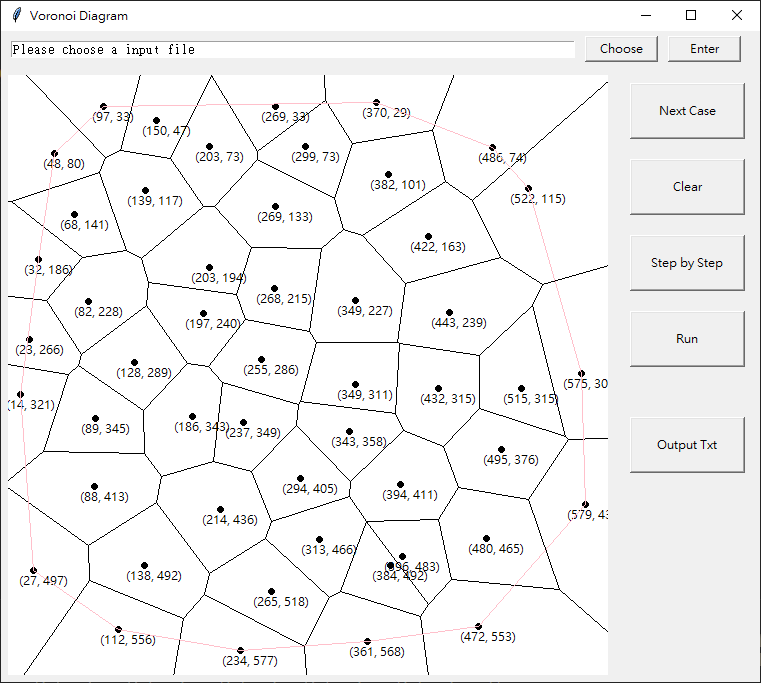
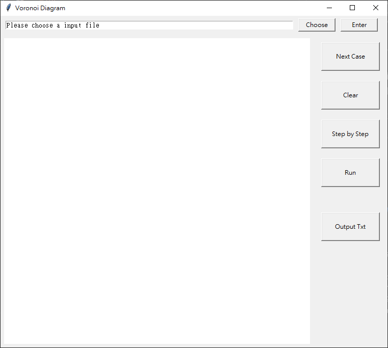
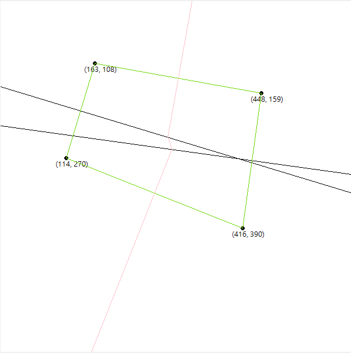
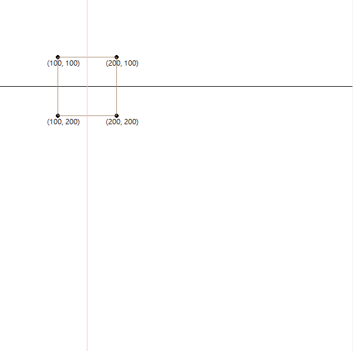

# Voronoi Diagram

NSYSU 演算法設計與分析

資工碩 M103040027 陳冠廷



---
- [Voronoi Diagram](#voronoi-diagram)
  - [- 附錄](#--附錄)
  - [軟體規格書](#軟體規格書)
    - [輸入與輸出（資料）規格](#輸入與輸出資料規格)
      - [輸入規格](#輸入規格)
      - [輸出規格](#輸出規格)
    - [功能規格與介面規格](#功能規格與介面規格)
    - [軟體測試規劃書](#軟體測試規劃書)
  - [軟體說明](#軟體說明)
    - [安裝說明](#安裝說明)
    - [使用說明](#使用說明)
      - [輸入](#輸入)
      - [程式執行](#程式執行)
  - [程式設計](#程式設計)
    - [資料結構](#資料結構)
      - [點 與 線段](#點-與-線段)
      - [Voronoi Diagram](#voronoi-diagram-1)
    - [三點以下](#三點以下)
    - [多點](#多點)
      - [Divide](#divide)
      - [Conquer](#conquer)
      - [Merge](#merge)
      - [Hyperplane](#hyperplane)
    - [改進](#改進)
  - [軟體測試與實驗結果](#軟體測試與實驗結果)
  - [結論與心得](#結論與心得)
  - [附錄](#附錄)
---

- [x] 題目、系級、姓名、學號
- [x] 軟體規格書：包含「輸出與輸入（資料）規格」、「功能規格與介面規格」、「軟體測試規劃書」與其他有利於軟體開發之規格。
- [x] 軟體說明：為軟體安裝與使用之說明，請提供安裝與使用時需特別注意之要點，以減少評分之障礙。
- [x] 程式設計：將演算法於程式設計中，需要使用的資料結構，所需注意的細節或特別的技巧，在此部分講述。如果演算法有改良之處，亦在此描述。
- [ ] 軟體測試與實驗結果：軟體之測試報告。包含測試的環境、使用的電腦硬體系統（CPU型號、記憶體容量等）、作業系統、編譯器名稱及版本。然後列出測試數據。必須列出程式可以執行之範例數據（最好列出程式可以執行之極限數據）。如果有些情況無法執行，請列出可能原因及可能解決之道。並請提供測試時之「測試輸入檔」與「測試輸出檔」。
- [x] 結論與心得：說明所得結論、可以改良之處與心得等。
- [x] 附錄：請連結「程式原始碼合併檔」、「測試輸入檔」、「測試輸出檔」等與報告相關之資料。

## 軟體規格書

### 輸入與輸出（資料）規格

與課程 演算法設計與分析 Term Project 實施要點 相同

#### 輸入規格

第一行的數字 n 代表此次輸入有 n 個點

接下來 n 行為輸入的點 (x, y)

```
6
12 89
124 592
131 11
543 212
23 400
312 12
```

#### 輸出規格

前 n 行代表 輸入的 n 個點，以 'P' 開頭

剩餘代表圖上所有的線，以 'E' 開頭

```
P 12 89
P 23 400
P 124 592
P 131 11
P 312 12
P 543 212
E -186582.5 6844.5 194.875207964913 238.22627881796043
E -115126.5 61096.0 307.2388494294646 373.0436260813767
E -46728.5 -71350.0 194.875207964913 238.22627881796043
E 194.875207964913 238.22627881796043 220.20851000468005 245.25968915291014
E 220.20851000468005 245.25968915291014 276.08778522400166 286.8811080662708
E 220.20851000468005 245.25968915291014 821.5 -108588.5
E 276.08778522400166 286.8811080662708 307.2388494294646 373.0436260813767
E 276.08778522400166 286.8811080662708 120427.5 -138488.0
E 307.2388494294646 373.0436260813767 228333.5 251802.0
```

### 功能規格與介面規格



- 檔案選取
  - 最上排為檔案的選取
- 畫布
  - 左下白色方框
  - 大小為 600 x 600
- 程式執行
  - 右下的按鈕分別為程式執行的各項功能

詳細使用請參照 [使用說明](#使用說明)

### 軟體測試規劃書

- 1 ~ 3 點
  - 暴力解
- 4 ~ 6 點
  - 進行一次的 Divide 和 Merge
- 7 點以上
  - 進行多次的 Divide 和 Merge

## 軟體說明

### 安裝說明

- 下載 [主程式](./dist/main) 並執行即可。

### 使用說明

#### 輸入

1. 直接在畫布上隨意點擊
2. 檔案選取
   - Choose
     1. 直接選取想要的測試檔
     2. 選取輸出的 .out 檔
   - Enter
     - 確認輸入的檔案並執行相對應的動作

#### 程式執行

- Next Case
  - 若有讀取測試檔，點擊此鈕以切換下一筆測資
- Clear
  - 清空畫布
- Step by Step
  - 一步步執行 Voronoi Diagram
- Run
  - 將結果直接呈現
- Output Txt
  - 將最後結果輸出成 .out 檔

## 程式設計

### 資料結構

#### 點 與 線段

單純的以 list 進行存取

#### Voronoi Diagram

使用 list 兩個list存取所有的 點 與 線

> 中垂線與畫出此中垂線的兩個點 index 是相同的

### 三點以下

以暴力解直接解決

- 一點
  - 無視
- 二點
  - 直接畫出中垂線
- 三點
  1. 先將三點排序為逆時針，確保求出向量的方向可以從外心指向三角形的外部
  2. 求出 3點 相連上較短的 2 條邊，並畫出其中垂線
  3. 檢查畫出的中垂線在畫布上是否有交點，若有則繼續求出第 3 條中垂線，若無到此中止

### 多點

因應課程要求，採用 Divide and Conquer

#### Divide

1. 將所有的點依 座標 x 的大小排序
2. 將兩半分別丟入 函式內遞迴執行

#### Conquer

- 當函式內的點 <= 3 時，暴力解

#### Merge

- 目標：
  - 找出左右 2 邊 Voronoi Diagram 中間交匯處的 Voronoi Diagram，稱為 [Hyperplane](#Hyperplane)
  - 將合併後的多餘的線消除
- 多餘線段的消除

#### Hyperplane

繪出 Hyperplane 的步驟如以下所述：

1. 藉由合併左右兩邊的 Convex Hull 所獲得的上切線第一條 Hyperplane $h_1$
2. 接著使用這條 $h_1$ 與 畫出 $h_1$ 的兩個點身邊所有的邊檢查是否相交，若有多條相交，則選擇 座標 $y$ 值最大的交點 $I$ 作為下一條 Hyperplane $h_2$ 的啟始點
   - 接下來針對這個起始點會有3種情況:
     1. 交在 $I$ 上的線是左邊的線
        - 左邊的點換至相交的線對面的點
        - 
     2. 交在 $I$ 上的線是右邊的線
        - 左邊的點換至相交的線對面的點
        -  
     3. 兩側的邊同時交在 $I$ 上
        - 兩邊的點換至相交的線對面的點
        - 
3. 接下來用更新過的點與在 步驟2 中取得的起始點畫出下一段 Hyperplane
4. 重複 步驟2 ~ 3，直到左右兩邊的點 == 下切線的兩個點即完成 Hyperplane

### 改進

- 隨著點數增多，錯誤率也會跟提高，但尚未找到問題所在
- 需要額外加入多點共線的可能

## 軟體測試與實驗結果

- [公開測資](./Test/input.txt)
  - 可全數通過
- 隨機手點


## 結論與心得

這次的作業讓我再次深刻的體會到理論跟實作是存在著極大的差距的，實作更加的講求細節與效率，仔細的考慮各種可能的情況，並盡量的得到通解，是我在這次的作業中獲益最多的部份。

此外程式的架構也是極其重要，當我們無法把功能與資料結構徹底的分開，未來在處理錯誤與增加新功能時將會花費大量的時間在重新理解自己的程式碼，如何清楚的進行拆分也是我認為在這作業中非常重要的一環。

這次的作業確實是一個很好的考驗，不單單是對演算法的理解，更多的是個人在寫程式這件事情上的一個自我檢定，也看到了自己的不足，讓自己有方向改進。


## 附錄
- [主程式](./main.exe)
- [Python環境](./Evironment/requirements.yml)
  > 使用 Anaconda 建構
- [程式原始碼合併檔](./Src/combine.txt)
- [測試輸入檔](./Test/input.txt)
- [測試輸出檔](./Test/output.out)

[Top](#voronoi-diagram)